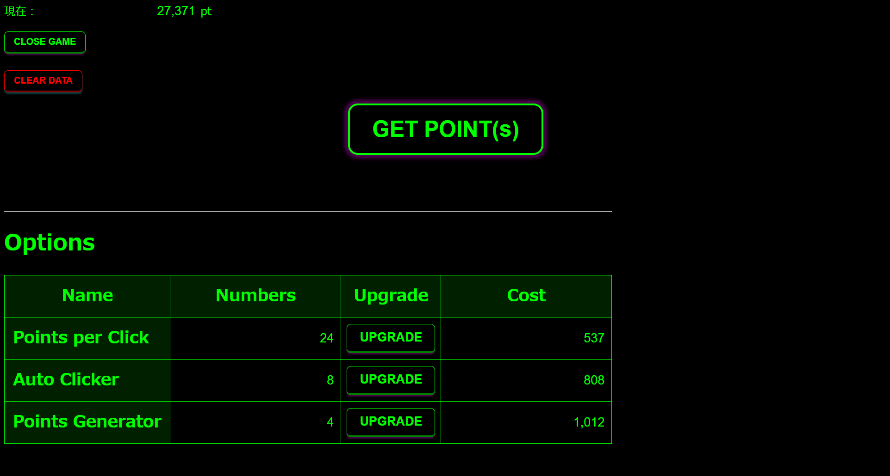

# SimpleClicker
JavaScriptを利用して作ったシンプルなクッキークリッカー系ゲーム。
[こちら](https://astounding-baklava-6653c2.netlify.app/)から遊べます。

Cookieを利用したオートセーブ機能を実装しています。

---

# 画面説明

## 画面上部
- 画面左上に現在のポイントが表示されます
- `CLOSE GAME`：ゲームのページを閉じます
- `CLEAR DATA`：進行状況をリセットします
- `GET POINT(s)`：手動でポイントを獲得します

## Options

ポイントを消費して様々な特典を購入できます
- Name：アイテム名
- Numbers：購入数
- Upgrade：購入ボタン
- Cost：消費ポイント量

- Points per Click：1クリックあたりのポイント獲得量を増加させます
- Auto Clicker：毎秒購入数分だけポイントを自動で獲得します
- Points Generator：毎秒ポイントを自動で獲得します。Auto Clickerよりポイント獲得量が多いです。